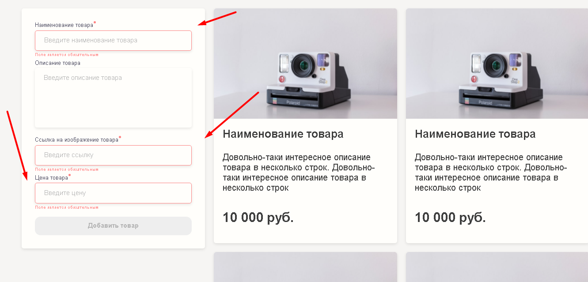
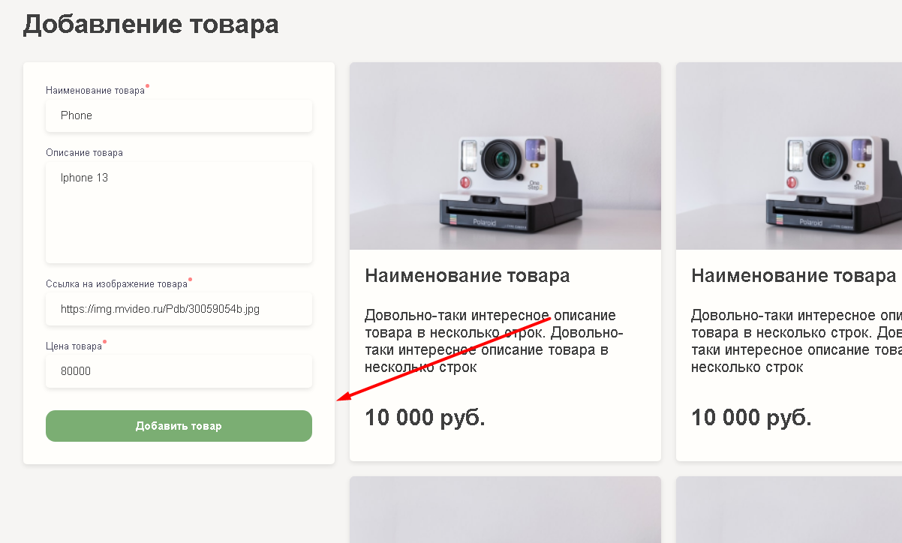
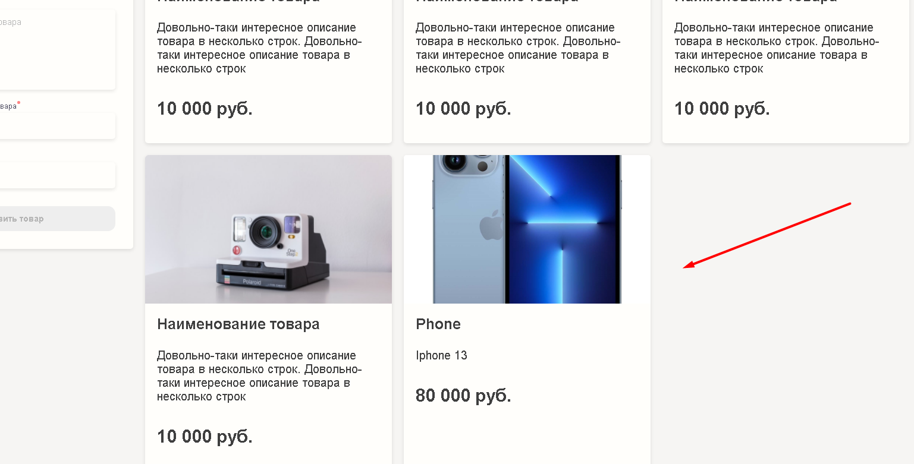
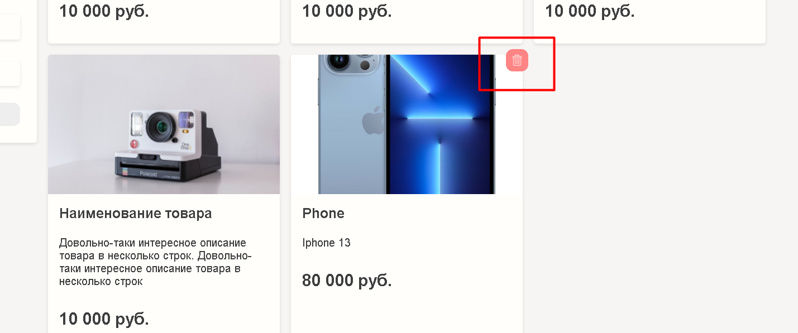

# ida-form

## GH-PAGES LINK: https://yaroslavborshevsky812.github.io/ida-form/

## QUICK START

```
    npm i
    gulp style watch
```


## DESCRIPTION
1. Validation form will not let you to add the item if required fields  is not fill 

2. Fill out the form and click add

3. You will see new item in the end of the list

4. You can also delete the item


